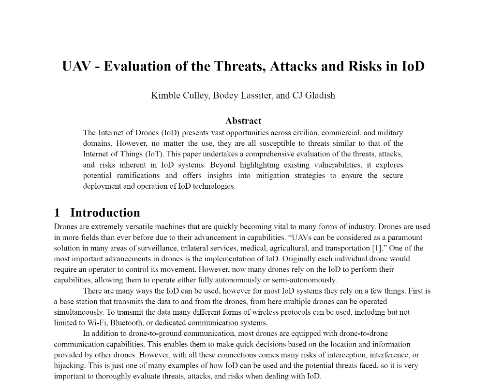

# UAV Security Research

# - Fall 2024 Semester Research Project
# - Supervised with Dr. Jian Wang, Chair of Cybersecurity, at University of Tennessee - Martin

------------------------
# Abstract
  - The Internet of Drones (IoD) presents vast opportunities across civilian, commercial, and military
    domains. However, no matter the use, they are all susceptible to threats similar to that of the
    Internet of Things (IoT). This paper undertakes a comprehensive evaluation of the threats, attacks,
    and risks inherent in IoD systems. Beyond highlighting existing vulnerabilities, it explores
    potential ramifications and offers insights into mitigation strategies to ensure the secure
    deployment and operation of IoD technologies.

----------------------
This research was conducted in tandem with Kimble Culley (c) and Bodey Lassiter (c) , All Rights Reserved.
